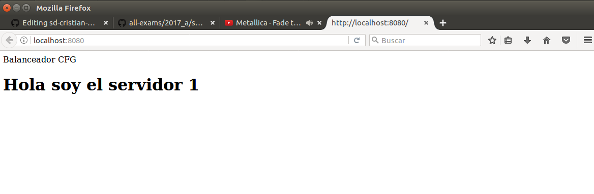

## Parcial 2 - Sistemas Distribuidos
## Cristian Felipe González - Cód. A00221904

## Descripción
Se debe implementar un balanceador de carga para tres servidores web, haciendo uso de automatización de infraestructura mediante con contenedores usando Docker.  A continuación, tenemos la arquitectura de la solución

<p align="center">
  
</p>

## Desarrollo
Servidores web: se usó Apache 2 para la implementación de los servicios web.

- Archivo Dockerfile de configuración
```
FROM httpd
ADD index.html /usr/local/apache2/htdocs/index.html
```
- Archivo index.html
```
<!DOCTYPE html>
<html >
<head> 
Balanceador CFG
</head>
<body>
<h1>Hola soy el servidor 1</h1>			 
</body>
</html>
```

Balanceador de carga: se usó Nginx.

- Dockerfile
```
#Instalamos NGINX
FROM nginx

#Eliminamos el archivo de configuración por defecto y su carpeta

RUN rm /etc/nginx/conf.d/default.conf && rm -r /etc/nginx/conf.d

#Agregamos el archivo de configuración

ADD nginx.conf /etc/nginx/nginx.conf

#Se evita la detención del contenedor

RUN echo "daemon off;" >> /etc/nginx/nginx.conf

CMD service nginx start
```

- Configuración del servicio nginx.conf
```
worker_processes 4;
 
events { worker_connections 1024; }
 
http {
    sendfile on;
 
    upstream app_servers {
        server app1:80;
        server app2:80;
        server app3:80;
    }
 
    server {
        listen 80;
 
        location / {
            proxy_pass         http://app_servers;
            proxy_redirect     off;
            proxy_set_header   Host $host;
            proxy_set_header   X-Real-IP $remote_addr;
            proxy_set_header   X-Forwarded-For $proxy_add_x_forwarded_for;
            proxy_set_header   X-Forwarded-Host $server_name;
        }
    }
}
```

- docker-compose.yml
```
version: '2'
 
services:
  app1:
    build:
      context:  ./app1
      dockerfile: Dockerfile

  app2:
    build:
      context:  ./app2
      dockerfile: Dockerfile 

  app3:
    build:
      context:  ./app3
      dockerfile: Dockerfile
 
  proxy:
    build:
      context:  ./nginx
      dockerfile: Dockerfile
    ports:
      - "8080:80"
    links:
      - app1
      - app2
      - app3
 ```
  
 ## Implementación 
 Una vez se tienen los archivos de configuración, con los siguientes comandos se ejecuta el servicio.
 
```
#docker-compose build .
#docker-compose up
```


## Prueba de funcionamiento
A continuación se adjuntan capturas del servicio funcionando.

<p align="center">
  <br>
  <b>Captura 1. Web 1.</b><br><br>
</p>

<p align="center">
  <br>
  <b>Captura 2. Web 2.</b><br><br>
</p>

<p align="center">
  <br>
  <b>Captura 3. Web 3.</b><br><br>
</p>


